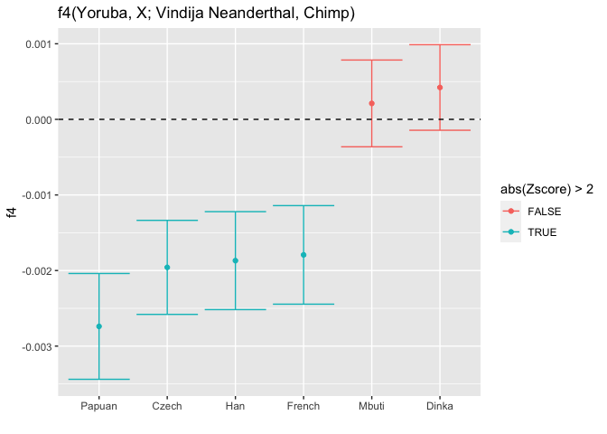
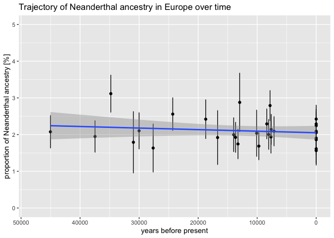
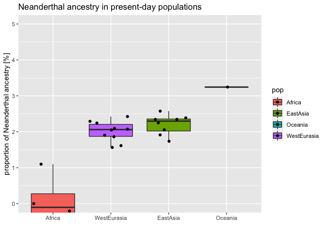

Demo tutorial
================

## Introduction

Lets load all pre-requisites first. You should first install them by
running `install.packages(c("admixr", "tidyverse"))`. Note that this
make take a long time because there are a lots of C/C++ dependencies
which need to be compiled (on a freshly installed system, this could
easily take 20 minutes).

``` r
library(admixr)
library(tidyverse)
```

    ## ── Attaching packages ─────────────────────────────────────── tidyverse 1.3.0 ──

    ## ✓ ggplot2 3.3.3     ✓ purrr   0.3.4
    ## ✓ tibble  3.1.0     ✓ dplyr   1.0.2
    ## ✓ tidyr   1.1.2     ✓ stringr 1.4.0
    ## ✓ readr   1.4.0     ✓ forcats 0.5.0

    ## ── Conflicts ────────────────────────────────────────── tidyverse_conflicts() ──
    ## x dplyr::filter() masks stats::filter()
    ## x dplyr::lag()    masks stats::lag()

## Demo \#1

Let’s get the technicalities out of the way first:

1.  What does the *admixr* R package actually do compared to ADMIXTOOLS?

See the [tutorial](https://bodkan.net/admixr/articles/tutorial.html) for
a lengthy discussion on this topic. Briefly, it makes it possible to do
almost everything that ADMIXTOOLS (I would even say 100% of things an
average popgen paper needs) using a set of simple R functions, *entirely
from within R*. No shell scripting, no manual editing of files and
copy-pasting results from the terminal elsewhere for further processing
and plotting…

2.  What is the required file format?

#### EIGENSTRAT file format

Let’s direct *admixr* to the location of the EIGENSTRAT trio data files.
Note that this doesn’t load any data into R! It just creates “pointers”
to where the data files are located on your disk and collects this
information in a single R object called `data`. This object is used as
input for all *admixr* function we will use here (and also many others
described in the
[tutorial](https://bodkan.net/admixr/articles/tutorial.html) and
[reference manual](https://bodkan.net/admixr/reference)).

``` r
data <- eigenstrat("data/snps")
data
```

    ## EIGENSTRAT object
    ## =================
    ## components:
    ##   ind file: data/snps.ind
    ##   snp file: data/snps.snp
    ##   geno file: data/snps.geno

Each EIGENSTRAT data set has three components: a trio of `ind/snp/geno`
files, which can be loaded with `read_*()` functions. These are not used
very often, but are *very* useful for filtering, processing data,
troubleshooting, etc.

-   `ind` file:

``` r
ind <- read_ind(data)
ind
```

    ## # A tibble: 47 x 3
    ##    id           sex   label        
    ##    <chr>        <chr> <chr>        
    ##  1 Bichon       M     Bichon       
    ##  2 KK1          M     Kotias       
    ##  3 SATP         M     Satsurblia   
    ##  4 Motala12     M     Motala12     
    ##  5 I9030        M     Villabruna   
    ##  6 I0062        M     Vestonice16  
    ##  7 I0876        M     Kostenki14   
    ##  8 I0869.damage F     Ostuni1      
    ##  9 I0907.damage F     ElMiron      
    ## 10 I9050.damage F     AfontovaGora3
    ## # … with 37 more rows

``` r
nrow(ind)
```

    ## [1] 47

-   `snp` file:

``` r
snp <- read_snp(data)
snp
```

    ## # A tibble: 2,144,502 x 6
    ##    id            chrom     gen    pos ref   alt  
    ##    <chr>         <chr>   <dbl>  <int> <chr> <chr>
    ##  1 Affx-34462167 1     0.00567 567137 T     C    
    ##  2 rs3094315     1     0.00753 752566 G     A    
    ##  3 rs12562034    1     0.00768 768448 A     G    
    ##  4 rs12124819    1     0.00776 776546 A     G    
    ##  5 1_777122      1     0.00777 777122 A     T    
    ##  6 1_832756      1     0.00833 832756 T     G    
    ##  7 rs28765502    1     0.00833 832918 T     C    
    ##  8 1_834832      1     0.00835 834832 G     C    
    ##  9 1_838555      1     0.00839 838555 C     A    
    ## 10 1_838931      1     0.00839 838931 A     C    
    ## # … with 2,144,492 more rows

``` r
nrow(snp) / 1e6 # how many millions of sites we have genotyped?
```

    ## [1] 2.144502

-   `geno` file:

``` r
geno <- read_geno(data)
geno
```

    ## # A tibble: 2,144,502 x 47
    ##    Bichon   KK1  SATP Motala12 I9030 I0062 I0876 I0869.damage I0907.damage
    ##     <int> <int> <int>    <int> <int> <int> <int>        <int>        <int>
    ##  1      0     0     0        0    NA    NA    NA           NA           NA
    ##  2      0     0     0        0     0     0     0            2            0
    ##  3     NA    NA    NA        0     0    NA     0           NA           NA
    ##  4      2     0     2        2    NA    NA     2           NA            2
    ##  5      0     0    NA        0    NA    NA    NA           NA           NA
    ##  6      2     0     2        0    NA     2    NA           NA           NA
    ##  7      2     2     2        0     2    NA     2           NA           NA
    ##  8      2     2     2        2    NA     0     2           NA            0
    ##  9      2     2     2        2    NA    NA     0           NA           NA
    ## 10      2     2    NA        2     2    NA     0           NA           NA
    ## # … with 2,144,492 more rows, and 38 more variables: I9050.damage <int>,
    ## #   Ranchot.damage <int>, Q116 <int>, Rochedane <int>, I1577 <int>, MA1 <int>,
    ## #   KO1 <int>, LaBrana1 <int>, I0061 <int>, Loschbour <int>, Ust_Ishim <int>,
    ## #   Stuttgart <int>, Estonian <int>, Mbuti <int>, Korean <int>, Yoruba <int>,
    ## #   Hezhen <int>, Orcadian <int>, Japanese <int>, Saharawi <int>, Tujia <int>,
    ## #   Greek <int>, Russian <int>, Dai <int>, Han <int>, Dinka <int>, Czech <int>,
    ## #   Icelandic <int>, Uygur <int>, Burmese <int>, Tuscan <int>, Papuan <int>,
    ## #   Spanish <int>, Adygei <int>, French <int>, Chimp <int>, Vindija <int>,
    ## #   Altai <int>

We can see that the only genotypes present are reference and alternative
homozygotes (values 2 and 0, respectively - note the difference from VCF
format 🙄).

There are no heterozygous sites in our demo data because all genomes
have been pseudo-haplodized (a random allele was drawn at each
heterozygous position). In other cases, allele types 0, 1, and 2 would
be present.

``` r
table(geno$I0876) # Kostenki-14
```

    ## 
    ##       0       2 
    ##  461818 1285547

``` r
table(geno$Vindija)
```

    ## 
    ##       0       2 
    ##  597504 1361792

Note: in case you want to generate your own EIGENSTRAT data (from VCF
files, etc.) or if you want to somehow process or filter data you
already have, functions `write_snp/write_ind/write_geno` can be very
useful.

## Demo \#2

1.  Performing admixture tests with *f*<sub>4</sub> and *D* statistics
    using *admixr*

2.  Opening the black box - calculating admixture test “manually”

### 1. *f*<sub>4</sub> and *D* statistics using *admixr*

Let’s first test *f4(Dinka, Yoruba; Neanderthal, Chimp)*:

``` r
f4_afr <- f4(W = "Yoruba", X = "Dinka", Y = "Vindija", Z = "Chimp", data = data)
f4_afr
```

    ## # A tibble: 1 x 10
    ##   W      X     Y       Z           f4   stderr Zscore  BABA  ABBA   nsnps
    ##   <chr>  <chr> <chr>   <chr>    <dbl>    <dbl>  <dbl> <dbl> <dbl>   <dbl>
    ## 1 Yoruba Dinka Vindija Chimp 0.000422 0.000283   1.49 56947 56147 1897864

The explicit argument names are not mandatory, but I personally *always*
use them. For the right order of arguments, check out `?f4` and other
manual pages right from R.

Note: there are 4 x 3 x 2 x 1 = 24 combinations of quartets of samples
like this. Many of them are symmetrical and will yield exactly the same
result, others will differ up to a sign. As an exercise, you can
convince yourself of this by changing the positions of those four
samples. Which quartets give the same results and why? Which differ only
by a sign?

In the literature, you often see a *D* statistic. As a statistical test,
these are basically interchangeable (and are actually calculated by the
same internal machinery):

Here is *D(Dinka, Yoruba; Neanderthal, Chimp)*:

``` r
d_afr <- d(W = "Yoruba", X = "Dinka", Y = "Vindija", Z = "Chimp", data = data)
d_afr
```

    ## # A tibble: 1 x 10
    ##   W      X     Y       Z          D  stderr Zscore  BABA  ABBA   nsnps
    ##   <chr>  <chr> <chr>   <chr>  <dbl>   <dbl>  <dbl> <dbl> <dbl>   <dbl>
    ## 1 Yoruba Dinka Vindija Chimp 0.0071 0.00474   1.49 56947 56147 1897864

Now *f4(Dinka, French; Neanderthal, Chimp)*:

``` r
f4_eur <- f4(W = "Yoruba", X = "French", Y = "Vindija", Z = "Chimp", data = data)
f4_eur
```

    ## # A tibble: 1 x 10
    ##   W      X      Y       Z           f4   stderr Zscore  BABA  ABBA   nsnps
    ##   <chr>  <chr>  <chr>   <chr>    <dbl>    <dbl>  <dbl> <dbl> <dbl>   <dbl>
    ## 1 Yoruba French Vindija Chimp -0.00179 0.000326  -5.51 57797 61201 1898093

We don’t have to run the test for each population at a time, but we can
give a vector of sample/population names as an input:

``` r
test <- c("French", "Czech", "Han", "Papuan", "Mbuti", "Dinka")

f4_multiple <- f4(W = "Yoruba", X = test, Y = "Vindija", Z = "Chimp", data = data)
f4_multiple
```

    ## # A tibble: 6 x 10
    ##   W      X      Y       Z            f4   stderr Zscore  BABA  ABBA   nsnps
    ##   <chr>  <chr>  <chr>   <chr>     <dbl>    <dbl>  <dbl> <dbl> <dbl>   <dbl>
    ## 1 Yoruba French Vindija Chimp -0.00179  0.000326 -5.51  57797 61201 1898093
    ## 2 Yoruba Czech  Vindija Chimp -0.00196  0.000311 -6.29  57406 61123 1898222
    ## 3 Yoruba Han    Vindija Chimp -0.00187  0.000324 -5.76  58057 61605 1898388
    ## 4 Yoruba Papuan Vindija Chimp -0.00274  0.00035  -7.82  57549 62747 1897946
    ## 5 Yoruba Mbuti  Vindija Chimp  0.000211 0.000287  0.734 59183 58783 1897659
    ## 6 Yoruba Dinka  Vindija Chimp  0.000422 0.000283  1.49  56947 56147 1897864

When we plot the results, we immediately see a pattern:

``` r
ggplot(f4_multiple, aes(fct_reorder(X, f4), f4, color = abs(Zscore) > 2)) +
  geom_point() +
  geom_errorbar(aes(ymin = f4 - 2 * stderr, ymax = f4 + 2 * stderr)) +
  geom_hline(yintercept = 0, linetype = 2) +
  labs(title = "f4(Yoruba, X; Vindija Neanderthal, Chimp)", x = "")
```

<!-- -->

### 2. Homebrew *f*<sub>4</sub> statistic (and *D* statistic)

``` r
# subset to only four columns, for brevity
gt <- geno[, c("Yoruba", "Dinka", "Vindija", "Chimp")] %>% na.omit

# detect two kinds of site patterns
baba <- with(gt,    Yoruba == Vindija & Dinka == Chimp      & Vindija != Chimp)
abba <- with(gt,    Yoruba == Chimp & Dinka == Vindija      & Vindija != Chimp)

# count the two site patterns
(total_baba <- sum(baba, na.rm = T))
```

    ## [1] 56947

``` r
(total_abba <- sum(abba, na.rm = T))
```

    ## [1] 56147

*f*<sub>4</sub> statistic:

``` r
(total_baba - total_abba) / nrow(gt)
```

    ## [1] 0.0004215265

D statistic:

``` r
(total_baba - total_abba) / (total_baba + total_abba)
```

    ## [1] 0.007073762

We can compare these to the result of `f4_afr` and `d_afr`.

Of course, this doesn’t give us Z-scores (p-values) and so we can’t
determine significance (although we could easily add that too) but it
servers as a useful demonstration that ADMIXTOOLS, *f*-statistics,
*admixr* and other tools are not black boxes built on high-level
techniques. In the end, they all boil down to this kind of calculation.

## Demo \#3 - *f*<sub>4</sub>-ratio statistic

To calculate admixture proportion, *admixr* has a function called
`f4ratio()`:

``` r
neand_one <- f4ratio(X = "French", A = "Altai", B = "Vindija", C = "Yoruba", O = "Chimp", data = data)

neand_one
```

    ## # A tibble: 1 x 8
    ##   A     B       X      C      O      alpha  stderr Zscore
    ##   <chr> <chr>   <chr>  <chr>  <chr>  <dbl>   <dbl>  <dbl>
    ## 1 Altai Vindija French Yoruba Chimp 0.0186 0.00410   4.54

We can see that the proportion of Neanderthal ancestry in a French
individual is about 1.9% (the column `alpha` in the table above). Again,
we can reproduce the same calculation “manually”, by estimating the
individual components ourselves and taking the ratio. This is obviously
inefficient, but it’s good to keep in mind that there’s no magic behind
the scenes:

``` r
numerator <- f4(W = "Yoruba", X = "French", Y = "Altai", Z = "Chimp", data = data)
denominator <- f4(W = "Yoruba", X = "Vindija", Y = "Altai", Z = "Chimp", data = data)

numerator$f4 / denominator$f4
```

    ## [1] 0.01867924

This is a method for estimating Neanderthal ancestry proportion
sometimes called “direct *f*<sub>4</sub>-ratio” based on [Petr *et al.*
(2019)](https://www.pnas.org/content/116/5/1639). Note that the ordering
of the populations in the quartet is slightly different from the
definition of *f*<sub>4</sub>-ratio statistic in the paper. I changed
the order in this tutorial to make the calculation more similar to our
simple examples of testing for the *presence* of Neanderthal ancestry
above.

You can see for yourself that due to the symmetries of the four
population quartets, we still get the same result even when we calculate
the statistic using the order of the populations from the Petr *et al.*
(2019) paper:

``` r
x <- f4(W = "Altai", X = "Chimp", Y = "French", Z = "Yoruba", data = data)
y <- f4(W = "Altai", X = "Chimp", Y = "Vindija", Z = "Yoruba", data = data)

x$f4 / y$f4 # this is same as this ...
```

    ## [1] 0.01867924

``` r
numerator$f4 / denominator$f4 # ... from the previous example
```

    ## [1] 0.01867924

The fact that many “different” *f*<sub>4</sub> and *D*-statistics mean
actually the same thing sometimes make reading papers extremely
difficult (for me) and frustrating. Everybody has a different preference
and its good to keep this in mind.

Let’s be even more ambitions and perform this test on all present-day
individuals in our data set.

First, we will load the annotation table with individual names and
population assignments:

``` r
samples <- read_tsv("data/samples.tsv")
```

    ## 
    ## ── Column specification ────────────────────────────────────────────────────────
    ## cols(
    ##   name = col_character(),
    ##   age = col_double(),
    ##   pop = col_character()
    ## )

Now we can estimate the proportion of Neanderthal ancestry in all
samples at once:

``` r
neand_all <- f4ratio(X = samples$name, A = "Altai", B = "Vindija", C = "Yoruba", O = "Chimp", data = data)
neand_all
```

    ## # A tibble: 44 x 8
    ##    A     B       X             C      O      alpha  stderr Zscore
    ##    <chr> <chr>   <chr>         <chr>  <chr>  <dbl>   <dbl>  <dbl>
    ##  1 Altai Vindija UstIshim      Yoruba Chimp 0.0208 0.00446   4.65
    ##  2 Altai Vindija Kostenki14    Yoruba Chimp 0.0195 0.00434   4.50
    ##  3 Altai Vindija GoyetQ116-1   Yoruba Chimp 0.0312 0.00510   6.11
    ##  4 Altai Vindija KremsWA3      Yoruba Chimp 0.0179 0.00840   2.13
    ##  5 Altai Vindija Vestonice16   Yoruba Chimp 0.0210 0.00498   4.22
    ##  6 Altai Vindija Ostuni1       Yoruba Chimp 0.0163 0.00659   2.48
    ##  7 Altai Vindija Malta1        Yoruba Chimp 0.0256 0.0045    5.69
    ##  8 Altai Vindija ElMiron       Yoruba Chimp 0.0242 0.00533   4.54
    ##  9 Altai Vindija AfontovaGora3 Yoruba Chimp 0.0192 0.00740   2.60
    ## 10 Altai Vindija Villabruna    Yoruba Chimp 0.0200 0.00467   4.27
    ## # … with 34 more rows

Let’s combine the table of Neanderthal ancestry proportions with our
annotation table of population assignments and radiocarbon ages:

``` r
combined <- inner_join(neand_all, samples, by = c("X" = "name"))
```

What does the trajectory of Neanderthal ancestry in Europe over the last
\~50 thousand years look like?

``` r
filter(combined, pop %in% c("EMH", "WestEurasia")) %>% # keep only relevant samples
  ggplot(aes(age, alpha * 100)) +
  geom_point() +
  ylim(0, 5) + xlim(48000, 0) +
  labs(title = "Trajectory of Neanderthal ancestry in Europe over time",
       x = "years before present", y = "proportion of Neanderthal ancestry [%]") +
  geom_smooth(method = "lm") # add a linear regression fit
```

    ## `geom_smooth()` using formula 'y ~ x'

<!-- -->

Are there differences in the amounts of Neanderthal ancestry between
present-day populations?

``` r
filter(combined, age == 0) %>%
  ggplot(aes(fct_reorder(pop, alpha), alpha * 100, fill = pop)) +
  geom_boxplot() +
  geom_jitter() +
  ylim(0, 5) +
  labs(title = "Neanderthal ancestry in present-day populations",
       x = "", y = "proportion of Neanderthal ancestry [%]")
```

    ## Warning: Removed 2 rows containing non-finite values (stat_boxplot).

    ## Warning: Removed 3 rows containing missing values (geom_point).

<!-- -->

## Demo \#4

Manually prepared `par` file:

``` bash
cat oldschool/config.par
```

    ## genotypename: data/snps.geno
    ## snpname: data/snps.snp
    ## indivname: data/snps.ind
    ## popfilename: oldschool/config.pop

Manually prepared `pop` file:

``` bash
cat oldschool/config.pop
```

    ## Altai Chimp : French Yoruba :: Altai Chimp : Vindija Yoruba

Run the `qpF4ratio` program from the command line and save the output to
`result.txt`:

``` bash
qpF4ratio -p oldschool/config.par > oldschool/result.txt
```

Inspect the result file:

``` bash
cat oldschool/result.txt
```

    ## qpF4ratio: parameter file: oldschool/config.par
    ## ### THE INPUT PARAMETERS
    ## ##PARAMETER NAME: VALUE
    ## genotypename: data/snps.geno
    ## snpname: data/snps.snp
    ## indivname: data/snps.ind
    ## popfilename: oldschool/config.pop
    ## ## qpF4ratio version: 400
    ## nplist: 1
    ##   0                Altai    1
    ##   1                Chimp    1
    ##   2               French    1
    ##   3               Yoruba    1
    ##   4              Vindija    1
    ## jackknife block size:     0.050
    ## snps: 2055942  indivs: 5
    ## number of blocks for block jackknife: 557
    ##                                                                                                            alpha     std. err  Z (null=0)
    ##  result:      Altai      Chimp     French     Yoruba  :      Altai      Chimp    Vindija     Yoruba     0.018608     0.004097      4.542   1930573
    ## ## end of run

You can see that the program estimated the same proportion of
Neanderthal ancestry in the French individual as the one we got out of
the `f4ratio()` function above using *admixr*. This is not surprising
because that function performs all the steps we did manually here for
us, automatically. This saves us a lot of work and avoids many potential
bugs, and allows us to focus on what’s really important.
